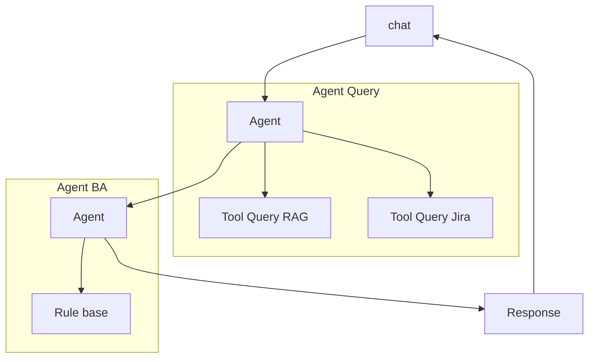

## Dirgram 

```mermaid
flowchart TB
    c1["chat"] --> a1[Agent]
    
    subgraph sa1[Agent Query]
        a1 --> ta1-l1["Tool Query RAG"]
        a1 --> ta1-l2["Tool Query Jira"]
    end
    
    a1 --> a2[Agent]
    
    subgraph sa2[Agent BA]
        a2 --> ta2-l1["Rule base"]
    end
    
    a2 --> r[Response]
    r --> c1

```