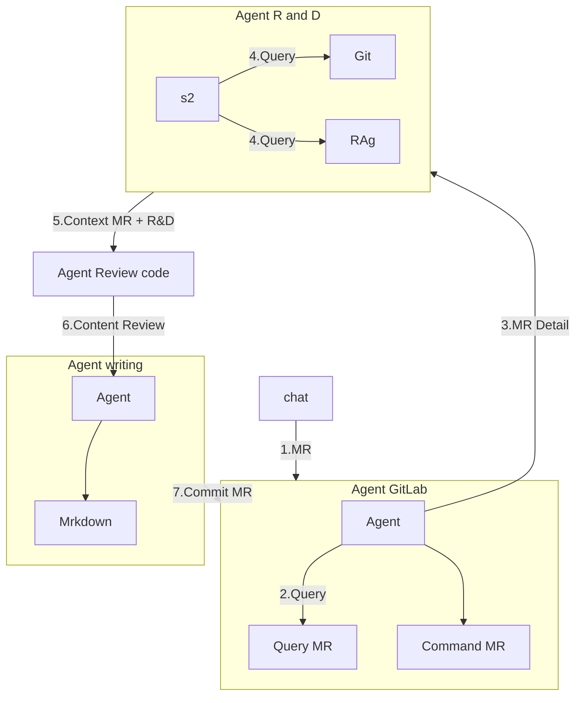

## Dirgram 

```mermaid


flowchart TB
    c1["chat"] -- 1.MR --> sa1[Agent]
    
    subgraph sa1[Agent GitLab]
        a1 --2.Query--> ta1-l1["Query MR"]
        a1 --> ta1-l2["Command MR"]
    end
    


    a1[Agent] --3.MR Detail--> sa2[Agent]
    subgraph sa2[Agent R and D]
      s2 -- 4.Query --> ta2-l1[Git]
      s2 -- 4.Query --> ta2-l2[RAg]
    end
    
    sa2 -- 5.Context MR + R&D--> sa3[Agent Review code]
    sa3 -- 6.Content Review --> sa4[Agent]
    subgraph s4[Agent writing]
        sa4 --> ta4-l1["Mrkdown"]
    end
    
    s4 -- 7.Commit MR--> sa1


    

```