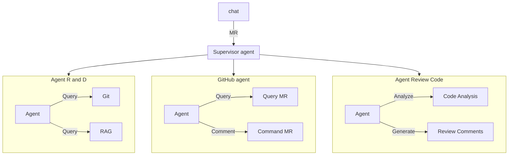

## Dirgram 

```mermaid


flowchart TD
    c1["chat"] -- MR --> sa1[Agent]


    subgraph sa1[Supervisor agent]
    end

    subgraph gh1[GitHub agent]
			a1["Agent"] --Query--> ta1-l1["Query MR"]
			a1 --"Comment"--> ta1-l2["Command MR"]
    end
    subgraph sa2[Agent R and D]
      a2["Agent"] --Query--> ta2-l1["Git"]
      a2 --Query--> ta2-l2["RAG"]
    end

    subgraph sa3[Agent Review Code]
      a3["Agent"] --Analyze--> ta3-l1["Code Analysis"]
      a3 --Generate--> ta3-l2["Review Comments"]
    end

		sa1 --> sa2
		sa1 --> gh1
		sa1 --> sa3


    

```